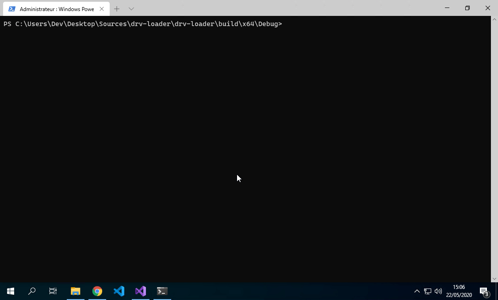

# drv-loader

Simple command line system driver (un)loader utility for Windows Operating system.

## Usage
Simple usage, you need to specify the operation to perform and the device name (when loading the file path should be passed as an argument as well, it is optional for unload operation).

To load a driver `.\drv-loader.exe -o load -d MyDesiredDisplayName <path to the driver file>`
To unload a driver `.\drv-loader.exe -o unload -d MyDesiredDisplayName`



Use `-h` switch for details (below)
```
PS C:\Users\Dev\Desktop\Sources\drv-loader\drv-loader\build\x64\Debug> .\drv-loader.exe -h
usage:
  drv-loader.exe [<Driver file path>] options

where options are:
  -?, -h, --help                   display usage information
  --display, -d <Display name>     Set the display name
  --operation, -o <load|unload>    Load or unload the specified driver```